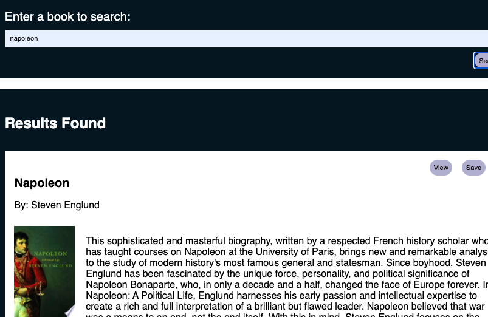

# Google-Books-Search

## Description

React-based Google Books Search app.

Seach:


Result:



Saved:


## Deployed app: https://morning-retreat-50855.herokuapp.com

## Installation
            
**Step 1 - Clone my repo using the command line below.**
```
git clone https://github.com/Antidetka/Google-Books-Search
```
**Step 2 - Change directory to the cloned repo folder.**
```
cd Google-Books-Search
```
**Step 3 - Install all required NPM packages.**
```
npm install, mongod, npm run seed
```
**Step 4 - Start the application server using the command line below**
```
npm start

```

## Technologies Implemented

* Bootstrap
* Express
* Node.js
* React.js
* MongoDB
* Heroku

            
## Usage
            
npm start

## License
            
Copyright (c) 2020 Regina Musovirova. Released under MIT. See the LICENSE file for more details.
        
            
## Questions
            
[](https://www.github.com/Antidetka) | 
[](mailto:musovirova@yahoo.com)
 
